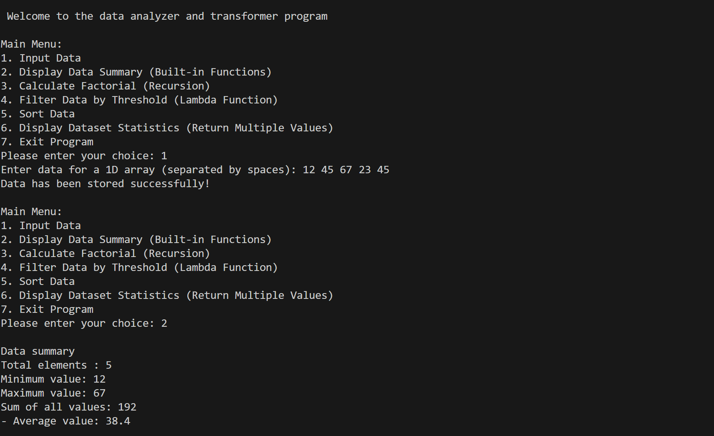

# 📊 Data Analyzer and Transformer Program

## 📌 Project Overview

The **Data Analyzer and Transformer Program** is a beginner-friendly Python project designed to work with numerical data and perform different data analysis and transformation operations.

This project is a menu-driven program that allows users to enter data, display a summary, calculate factorials, filter values, sort data, and display dataset statistics.

The project is created to practice important Python programming concepts such as functions, recursion, lambda functions, built-in functions, return values, `*args`, and `**kwargs`.

---

## ✨ Features

- 📥 Input 1D numerical data
- 📊 Display data summary
- 🧮 Calculate factorial using recursion
- 🔍 Filter data using Lambda and `filter()`
- 📈 Sort data in ascending or descending order
- 📋 Return multiple values from a function
- ⭐ Use `*args` for handling multiple values
- 🔑 Use `**kwargs` for handling keyword arguments
- 🔄 Menu-driven program
- 🧩 Simple and beginner-friendly implementation

---

## 🧠 Python Concepts Used

This project demonstrates the following Python concepts:

- Variables
- Lists
- Functions
- Global variables
- `input()`
- `split()`
- `map()`
- Built-in functions
- Recursion
- Lambda functions
- `filter()`
- `sorted()`
- Return multiple values
- `*args`
- `**kwargs`
- `while` loop
- `if-elif-else`
- String conversion and formatting

---

## ⚙️ Program Operations

### 1️⃣ Input Data

The program allows the user to enter multiple integer values separated by spaces.

Example:

```text
Enter data for a 1D array (separated by spaces): 10 25 15 40 30

The entered values are converted into integers and stored in a list.

2️⃣ Display Data Summary

This option displays basic information about the entered dataset.

It shows:

Total number of elements
Minimum value
Maximum value
Sum of all values
Average value

Example:

Data summary
Total elements : 5
Minimum value: 10
Maximum value: 40
Sum of all values: 120
- Average value: 24.0
3️⃣ Calculate Factorial

The program calculates the factorial of a number using recursion.

Example:

Enter a number to calculate its factorial: 5

Factorial of 5 is: 120

The factorial function calls itself until the base condition is reached.

4️⃣ Filter Data

The program filters values according to a threshold value.

It uses:

Lambda function
filter()

Example:

Enter a threshold value to filter out data above this value: 20

Filtered Data(Values>= 20 ):
25, 40, 30
5️⃣ Sort Data

The user can sort the dataset in two different ways:

Ascending order
Descending order

Example:

Choose Sorting option:

1. Ascending
2. Descending

The program uses Python's sorted() function to perform the sorting operation.

6️⃣ Display Dataset Statistics

This option calculates and displays:

Minimum value
Maximum value
Sum
Average

The statistics() function returns multiple values.

The project also demonstrates the use of:

*args

and

**kwargs

for handling multiple values and keyword-based values.

📋 Main Menu

The program provides the following menu:

Main Menu:
1. Input Data
2. Display Data Summary (Built-in Functions)
3. Calculate Factorial (Recursion)
4. Filter Data by Threshold (Lambda Function)
5. Sort Data
6. Display Dataset Statistics (Return Multiple Values)
7. Exit Program
🖥️ Sample Output
Welcome Screen
Welcome to the data analyzer and transformer program
Input Data
Main Menu:
1. Input Data
2. Display Data Summary (Built-in Functions)
3. Calculate Factorial (Recursion)
4. Filter Data by Threshold (Lambda Function)
5. Sort Data
6. Display Dataset Statistics (Return Multiple Values)
7. Exit Program

Please enter your choice: 1

Enter data for a 1D array (separated by spaces): 10 20 30 40 50

Data has been stored successfully!
Data Summary
Data summary
Total elements : 5
Minimum value: 10
Maximum value: 50
Sum of all values: 150
- Average value: 30.0
Factorial
Enter a number to calculate its factorial: 5

Factorial of 5 is: 120
Sorting
Choose Sorting option:

1. Ascending
2. Descending

Enter your choice: 1

Sorted Data in Ascending Order:
10, 20, 30, 40, 50


# 📸 Project Screenshots




💻 Requirements

To run this project, you need:

Python 3.x
Any Python-supported IDE or code editor

No external Python libraries are required.

🚀 How to Run
Step 1: Clone the Repository
git clone YOUR_REPOSITORY_URL
Step 2: Open the Project Folder
cd project_4
Step 3: Run the Python Program
python Function_treat.py

If the python command does not work on your system, you can also try:

py Function_treat.py
📁 Project Structure
project_4/
│
├── Function_treat_output.png
├── function_treat_output(2).png
├── Function_treat_output(3).png
├── Function_treat_output(4).png
├── Function_treat.py
└── README.md
📄 File Description
File	Description
Function_treat.py	Main Python program containing the Data Analyzer and Transformer implementation
Function_treat_output.png	Project output screenshot
function_treat_output(2).png	Project output screenshot
Function_treat_output(3).png	Project output screenshot
Function_treat_output(4).png	Project output screenshot
README.md	Project documentation
🎯 Learning Outcomes

By creating this project, I practiced:

Creating and using Python functions
Working with lists and numerical data
Using Python built-in functions
Understanding recursion
Using Lambda functions
Filtering data using filter()
Sorting data using sorted()
Returning multiple values from functions
Understanding *args
Understanding **kwargs
Creating menu-driven programs
Applying Python concepts together in one project
🔮 Future Improvements

The project can be improved in the future by adding:

Input validation
Support for decimal numbers
More data analysis operations
File handling for saving datasets
Additional filtering options
Graphical user interface
👩‍💻 Author

Vishakha Junjiya

This project was created as part of my Python learning journey to practice and strengthen fundamental Python programming concepts.

⭐ Conclusion

The Data Analyzer and Transformer Program combines several fundamental Python concepts into one simple menu-driven application.

It provides practical experience with functions, recursion, Lambda functions, filtering, sorting, multiple return values, *args, and **kwargs.